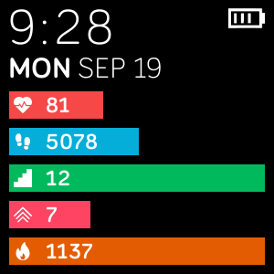

# FitBit-DailyStatsClockFace
---
### A straighforward FitBit clock face for tracking real-time and daily activity stats

**Target devices:**
- `meson` (Versa)
- `gemini` (Versa Lite)
- `mira` (Versa 2)

**Featured stats:**
- Heart rate
- Steps
- Elevation/floors
- Active zone minutes
- Calorie burn
- Battery charge
- Time (12h/24h)
- Day of week / date

*Daily stat indicator is based on the daily goal set in the fitbit mobile app. If the daily goal is met for the given stat, it will appear at full screen width.*

---
